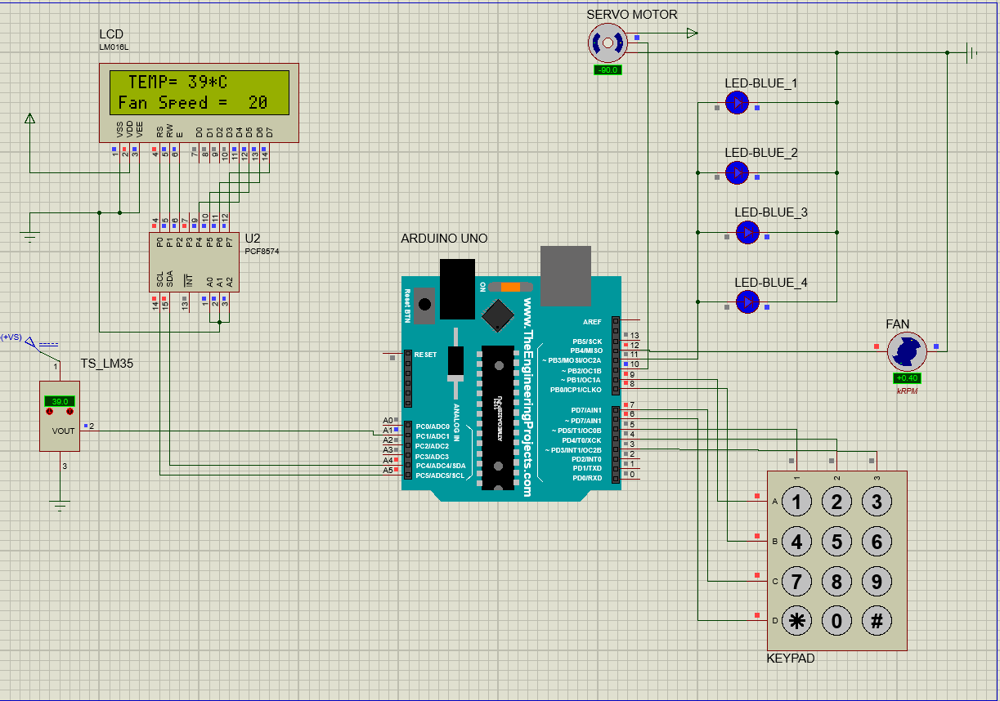

# Smart-Home-With-Arduino-Project
## What	is	a	Smart	Home?
- In the modern era, everyone wants ease of life with fewer difficulties. Yes it is true technology has made us lazy but on another hand, it improves every field of life.
- Now a day’s Home automation or Smart homes improve the living standards. It gave us the access to switch on and off any device or appliances easily and efficiently.
## Project Objectives :
- Gain knowledge in computer interfacing and how to make a stand alone device.
- Learn how to use the infrared to control a mechanical device.
- Interfacing KeyPAd And LCD Motors.
- Learn how to make a BCP Circuit.
- produce a prototype of Smart Home
## Project Requirments :
- The main gate of the house opens automatically when the correct password is entered on the keyboard.
- Lighting up the rooms when entering it.
- Measure the home temperature and display it on a LCD.
- when the room temperature will be greater than 38 degree Celsius, then the fan speed will be high otherwise it will be normal speed.
## System run :

